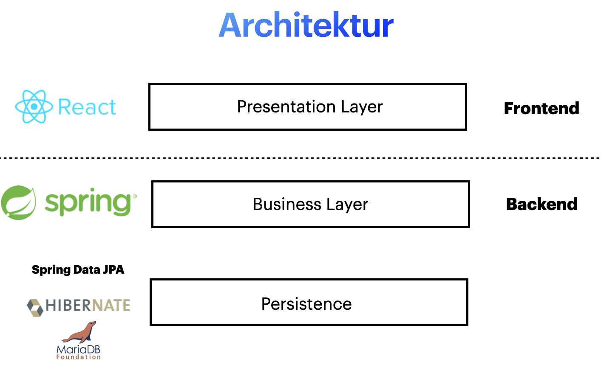
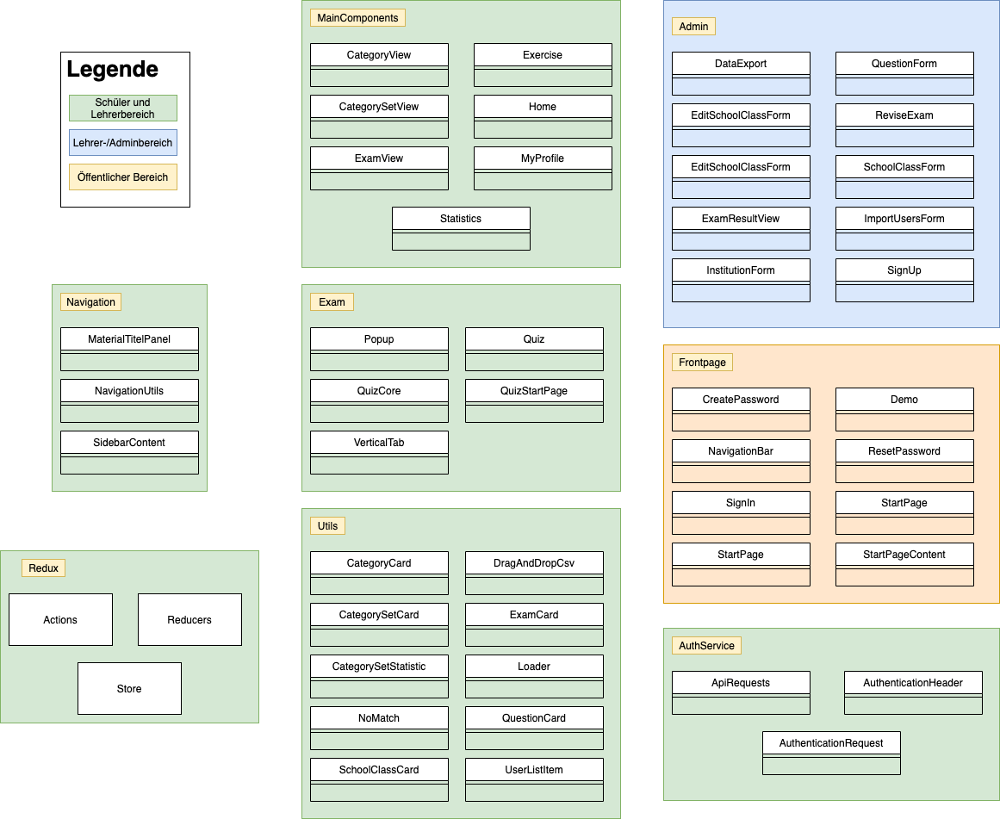

# Single-Page-Application made with React

## Components of the frontend

This project was bootstrapped with [Create React App](https://github.com/facebook/create-react-app).

## Available Scripts
Install all packages:

### `npm install`

Start the app (uses Port 3000):

### `npm start`

If you want to use Docker, build Docker Image:

### `docker build --tag electrolernapp:1.0 .`

Start the Docker Container (uses Port 1337):

### `docker run -p 1337:80 -d --name electrolernapp electrolernapp:1.0`

